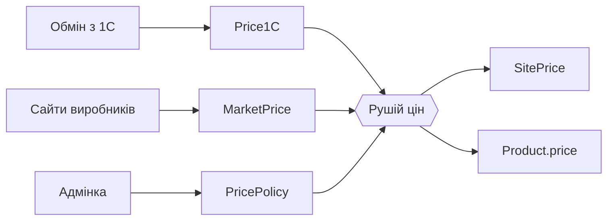

# Ціни вітрини

Як сайт вирішує, скільки коштує товар. Для тих, хто правитиме обмін, адмінку
чи рушій цін.

## Правило

Рішення власника від 14.09.2026: **роздріб на сайті = опт 1С + 25–30 %**, і
ціна має бути конкурентною з сайтами виробників.

- **Ціль** — опт × націнка, типово **+30 %**.
- Якщо на сайті виробника дешевше, ціна **опускається до ринкової**.
- Але **не нижче підлоги** — опт × **+25 %**.
- Дорожчий ринок ціну **не піднімає**: це лише позначка «запас до ринку».

Чому не «6.МАГАЗИНИ»: клієнти в 1С купують рівно за «4.ОПТ» (96–99 % рядків
реалізацій), а роздрібний тип ведуть нерегулярно. У STIHL він на 4 % вищий за
опт, у Grösser на 11 %, у STREND PRO на 46 %. Звірка 13.09.2026 показала, що
DNIPRO-M і STIHL стояли на сайті на 13–30 % дешевше, ніж у виробника.

## Будова

Ціни живуть окремим шаром, а не в картці товару:

| Таблиця | Що в ній | Хто пише |
|---|---|---|
| `Price1C` | Ціни 1С як є: `RETAIL` («6.МАГАЗИНИ») і `WHOLESALE` («4.ОПТ») | обмін з 1С |
| `MarketPrice` | Ціна того самого товару на сайті виробника: адреса, ціна, коли перевірено | скрипт наповнення, нічний воркер |
| `PricePolicy` | Націнка, підлога, чи звіряти з ринком — загальне (`id = default`) і по брендах | адмінка |
| `SitePrice` | Ціна вітрини, її походження (`basis`), вхідні дані й позначки | **лише рушій** |

`Product.price` — копія `SitePrice.price` для каталогу, кошика, застосунку й
SEO. Писати туди в обхід рушія не можна: наступний перерахунок затре.



Код:

- `src/lib/pricing/compute.ts` — формула, без бази. Тут усі пороги.
- `src/lib/pricing/engine.ts` — `repriceProducts(scope)`: читає шар, рахує, пише лише змінене.
- `src/lib/pricing/policy.ts` — правила.
- `src/lib/pricing/market/` — реєстр сайтів, читання сторінок, нічна переперевірка.
- `src/lib/sync-ingest/apply-prices.ts` — обмін: ціни 1С у `Price1C`, далі рушій.

## Походження ціни (`SitePrice.basis`)

| basis | Коли |
|---|---|
| `MARKUP` | опт × націнка; ринку немає або він дорожчий |
| `MARKET` | ринок між підлогою й ціллю — стоїмо на ринковій |
| `FLOOR` | ринок дешевший за підлогу — стоїмо на підлозі, **дорожчі за виробника** |
| `RETAIL_1C` | опту в 1С немає, або «6.МАГАЗИНИ» і опт різняться в рази (одиниці виміру) |
| `NONE` | цін 1С немає — ціну не чіпаємо |

Позначки (`flags`): `above_market`, `market_room`, `unit_mismatch`,
`market_ignored` — пояснення в `compute.ts`. Списки для людини — в адмінці
`/admin/pricing`.

## Коли перераховується

- **Обмін з 1С** змінив опт чи роздріб → рушій перераховує ці товари.
- **Воркер** уночі (01:00–06:00) переперевіряє ринкові ціни старші за тиждень,
  ~250 сторінок за чверть години → змінені товари перераховує й скидає кеш.
- **Адмінка**: зміна правила перераховує бренд або весь каталог одразу.
- **Скрипт** `scripts/pricing/reprice.mts` — масово, з пробою й бекапом.

Запобіжник асиметричний, як і раніше: подешевшання ціни 1С більш ніж у 5 разів
приймається лише після підтвердження наступною добою. Тип ціни, якого немає в
записі агента, з `Price1C` видаляється: агент шле товар з усіма цінами разом,
тож відсутність означає «в 1С немає» (опт при цьому пишеться в журнал як
`wholesale_removed`).

## Джерела ринкових цін

Реєстр — `src/lib/pricing/market/sources.ts`. Прив'язка сторінки до товару —
**лише за артикулом, який сторінка назвала сама**, плюс перевірка схожості назв.

| Сайт | Бренди | Як читається ціна |
|---|---|---|
| apro.ua | APRO | мікророзмітка |
| sigma.ua | SIGMA, ULTRA | JSON-LD |
| polax.ua | POLAX | JSON-LD |
| dnipro-m.ua | DNIPRO-M | JSON-LD |
| mastertool.ua | MASTERTOOL, GRANITE, … | заголовок сторінки |
| gradient.ua | GRADIENT, RHINO | Open Graph |
| revolt-tools.com.ua | REVOLT | Open Graph |

Без джерела: **СИЛА** (sila.com.ua оптовий, цін не показує), **SOMA FIX**,
**Makita** (цін немає), **TOTAL**, **UNIFIX**, **Grösser**, **STREND PRO**
(сайти ще не обходили). Для них діє чиста націнка.

### Додати джерело

1. Обійти сайт виробника: `scripts/vendor-catalog/fetch.mts <джерело> --all`
   (реєстр `scripts/vendor-catalog/vendors.ts`) — він знаходить, яка сторінка
   називає який артикул.
2. Додати рядок у `MARKET_SOURCES` зі способом читання ціни.
3. Наповнити й перерахувати:

```bash
npx tsx --env-file=.env scripts/pricing/seed-market-prices.mts <хост> --apply
npx tsx --env-file=.env scripts/pricing/reprice.mts            # проба
npx tsx --env-file=.env scripts/pricing/reprice.mts --apply
```

Новим товарам уже відомих брендів адресу знаходить повторний обхід і
наповнення: воркер переперевіряє лише відомі адреси.

## 1С

У 1С нічого не пишеться. Ціни 1С лише читаються обміном; усе, що сайт робить
із ними, робиться в цьому шарі.
