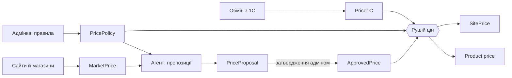

# Ціни вітрини

Як сайт вирішує, скільки коштує товар. Для тих, хто правитиме обмін, адмінку,
агента цін чи рушій.

## Правило

Рішення власника, редакція 14.09.2026:

- **Роздріб завжди строго дорожчий за опт 1С.** Дешевше опту товар не
  продається, хай що показує ринок і хай що затвердили.
- **Базова ціна** — опт × націнка, типово **+30 %**.
- **Конкурентну ціну пропонує агент** раз на тиждень: найнижча придатна ціна
  в інтернет-магазинах мінус **1 %**, але не нижче підлоги.
- **На вітрину пропозиція потрапляє лише після затвердження адміном.** Ринок
  сам ціну не рухає: сайти бувають порожні, з ціною без наявності чи з
  набором замість штуки.
- **Підлога** — опт × **1,01**, і в будь-якому разі хоч на гривню дорожче опту.

Чому не «6.МАГАЗИНИ»: клієнти в 1С купують рівно за «4.ОПТ» (96–99 % рядків
реалізацій), а роздрібний тип ведуть нерегулярно. Він лишився запасною ціною,
коли опту немає, і сторожем одиниць виміру.

## Будова

| Таблиця | Що в ній | Хто пише |
|---|---|---|
| `Price1C` | Ціни 1С як є: `RETAIL` («6.МАГАЗИНИ») і `WHOLESALE` («4.ОПТ») | обмін з 1С |
| `MarketPrice` | Сторінка товару на чужому сайті: адреса, ціна, наявність, стан останньої перевірки, хто знайшов | обхід сайтів виробників, агент, нічна переперевірка |
| `MarketLookup` | Коли агент шукав сторінки товару, скільки знайшов і скільки це коштувало | агент |
| `PriceProposal` | Пропозиція ціни: поточна, запропонована, ринкова з джерелом, позначки і стан усіх джерел | агент (щопонеділка) |
| `ApprovedPrice` | Затверджена адміном ціна | адмінка |
| `PricePolicy` | Націнка, підлога, знижка від ринку — загальне (`id = default`) і по брендах | адмінка |
| `SitePrice` | Ціна вітрини, її походження (`basis`) і позначки | **лише рушій** |

`Product.price` — копія `SitePrice.price` для каталогу, кошика, застосунку й
SEO. Писати туди в обхід рушія не можна: наступний перерахунок затре.



Код:

- `src/lib/pricing/compute.ts` — формула й підлога, без бази. Тут усі пороги.
- `src/lib/pricing/engine.ts` — `repriceProducts(scope)`: рахує й пише лише змінене.
- `src/lib/pricing/agent/` — пошук сторінок (`discover.ts`), перевірка артикулу
  (`verify.ts`), пропозиції (`propose.ts`), рішення адміна (`decide.ts`),
  розклад для воркера (`run.ts`).
- `src/lib/pricing/market/` — реєстр сайтів, читання сторінок, нічна переперевірка.
- `src/lib/sync-ingest/apply-prices.ts` — обмін: ціни 1С у `Price1C`, далі рушій.

## Походження ціни (`SitePrice.basis`)

| basis | Коли |
|---|---|
| `MARKUP` | опт × націнка — затвердженої ціни немає |
| `APPROVED` | затверджена адміном ціна |
| `FLOOR` | затверджена ціна стала нижчою за підлогу, бо зріс опт — стоїмо на підлозі |
| `RETAIL_1C` | опту в 1С немає, або «6.МАГАЗИНИ» і опт різняться в рази |
| `NONE` | цін 1С немає — ціну не чіпаємо |
| `MARKET` | застаріле, не пишеться |

## Агент цін

Розклад — `src/lib/pricing/agent/run.ts`, запускає воркер на Railway.

- **Щоночі 01:00–06:00.** Переперевірка відомих сторінок, кожна раз на тиждень.
  Пошук сторінок для товарів у наявності без свіжої ринкової ціни — до
  `PRICE_AGENT_PER_NIGHT` (типово 10) товарів за ніч, найбільший залишок першим.
- **Щопонеділка з 08:00.** Пропозиції на тиждень і підсумок у Telegram
  (`DIGEST_CHAT_ID`). В адмінці можна скласти їх і вручну.

**Пошук сторінок** робить Claude (`claude-opus-5`, низький effort) з пошуком в
інтернеті, обмеженим списком доменів `AGENT_DOMAINS`. Модель лише називає
адреси — ціну вона не бачить і не оцінює. Кожну адресу рушій відкриває сам,
читає ціну з розмітки і приймає сторінку, лише якщо її заголовок, опис чи
JSON-LD називає наш артикул цілим словом. Без `ANTHROPIC_API_KEY` пошук
пропускається, а пропозиції складаються з уже відомих джерел. Вартість пошуку
видно в адмінці: $10 за 1000 пошуків плюс токени.

**Пропозиція** береться з найнижчої придатної ціни. Непридатні джерела йдуть у
докази з поясненням: сторінка без ціни, зникла, сайт не пускає, ціну бачили
давно, ціна в рази відрізняється від опту. Джерела без наявності беруться лише
тоді, коли інших немає, з позначкою. Зміни, менші за 0,5 % і за 1 ₴, не
пропонуються.

Позначки пропозиції: `market_below_floor`, `only_out_of_stock`,
`single_source`, `big_change`, `price_up`.

## Коли перераховується ціна

- **Обмін з 1С** змінив опт чи роздріб — рушій перераховує ці товари.
- **Адмін затвердив пропозицію** або зняв затверджену ціну.
- **Адмін змінив правило** — перераховується бренд або весь каталог.
- **Скрипт** `scripts/pricing/reprice.mts` — масово, з пробою й бекапом.

Запобіжник обміну асиметричний: подешевшання ціни 1С більш ніж у 5 разів
приймається лише після підтвердження наступною добою. Тип ціни, якого немає в
записі агента, з `Price1C` видаляється.

## Джерела ринкових цін

Сайти з відомим способом читання ціни — `src/lib/pricing/market/sources.ts`.
Для решти сайтів, які знайшов агент, ціна читається загальним способом:
JSON-LD, мікророзмітка, Open Graph.

| Сайт | Звідки адреси | Як читається ціна |
|---|---|---|
| apro.ua | обхід виробника | мікророзмітка |
| sigma.ua | обхід виробника | JSON-LD |
| polax.ua | обхід виробника | JSON-LD |
| dnipro-m.ua | обхід виробника | JSON-LD або пропи сторінки |
| mastertool.ua | обхід виробника | блок ціни або заголовок |
| gradient.ua, revolt-tools.com.ua | обхід виробника | Open Graph |
| hotline.ua, epicentrk.ua, prom.ua та інші | агент | загальний спосіб |

Rozetka відповідає серверним запитам 403, тому її немає в списку агента.
Пошук на майданчиках robots.txt забороняє, сторінки товарів — дозволяє.

Перше наповнення з обходів сайтів виробників:

```bash
npx tsx --env-file=.env scripts/pricing/seed-market-prices.mts <хост> --apply
```

## 1С

У 1С нічого не пишеться. Ціни 1С лише читаються обміном; усе, що сайт робить
із ними, робиться в цьому шарі.
